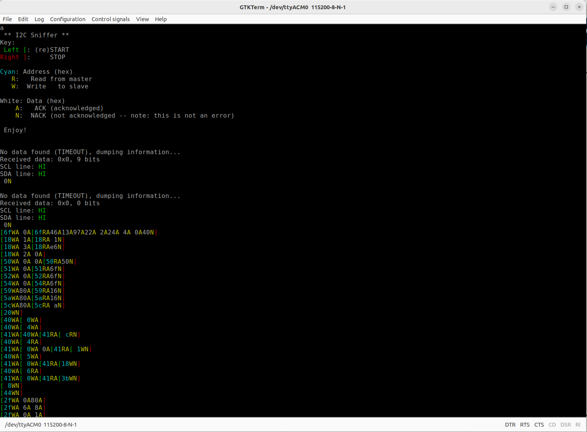
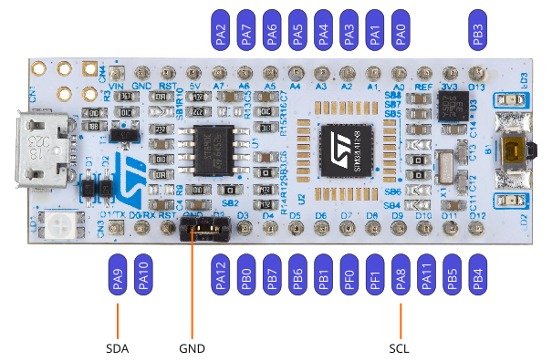

# I2C sniffer project
Port from kongr45gpen/i2c-sniffer to NUCLEO-L412KB Eval board.

- **Board:** [NUCLEO-L412KB](https://www.st.com/en/evaluation-tools/nucleo-l412kb.html)
- **Pins used:**
  - **PA8**: SCL
  - **PA9**: SDA
- **Serial baud rate**: 115 200 bits/s
- Board has integrated Virtual COM port (USB)

## Project Purpose
This project is built to connect to any I2C network and process any data sent through it in a transparent way.
It's useful for debugging faulty networks.
  
## Notes
- This project was built in [STM32CubeIDE](https://www.st.com/en/development-tools/stm32cubeide.html) v12.1.
- You can [download the .elf binary file](https://github.com/philippdiethelm/i2c-sniffer/releases) and immediately upload it to the MCU using [STM32CubeProgrammer](https://www.st.com/en/development-tools/stm32cubeprog.html) or [OpenOCD](http://openocd.org/).
- This project sets the processor clock to 72 MHz (Same as the original project).
  80 MHz would be possible for the L412KB MCU.
- The serial output contains colors. If your terminal doesn't support colors, you might see garbled characters.
  It uses ANSI escape sequences for color.
- UART is used to output the data. It uses the integrated VCP to output the serial data to the attached computer.
- The HAL driver is used, but all the necessary driver files are included in the *Drivers* folder.

## Important files
- **Src/main.c**: The source code of the project
- **i2c_sniffer.ioc**: Open this file inside STM32CubeIDE to edit the project.

## Screenshot

  
## Schematic

